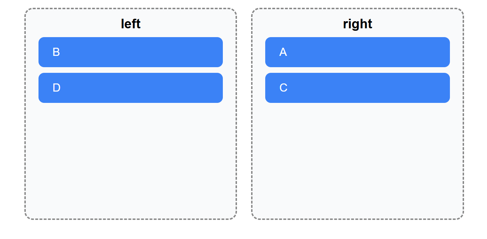

# [@dnd/core] 使用心得 / 使用文档

## ✨ 简介

`@dnd-kit` 是一个现代 React 拖拽库，提供 Draggable、Droppable、Sortable 等功能。

## 1. 核心基础组件

- DndContext:所有拖拽和被拖入区域以及相关 hooks 的使用都必须在这个上下文内
- Droppable:被拖入的区域
  - 示例代码：下方示例代码可以看出，Droppable 组件里面可以使用 useDroppable 狗子来进行组件的配置，示例中的 isOver 即为是否存在 Draggable 被拖入到了这个可拖入组件上面。id 为该组件的唯一标识符。

```jsx
export function Droppable({ id, children }) {
  const { setNodeRef, isOver } = useDroppable({ id });

  const style = {
    flex: 1,
    minHeight: "300px",
    margin: "0 10px",
    padding: "10px",
    border: "2px dashed #888",
    borderRadius: "12px",
    background: isOver ? "#dbeafe" : "#f9fafb",
    transition: "0.2s background ease",
  };

  return (
    <div ref={setNodeRef} style={style}>
      <h3 style={{ textAlign: "center" }}>{id}</h3>
      {children}
    </div>
  );
}
```

- Draggable:可拖动的元素
  - 示例代码：与可拖入区域一样，可拖动元素也存在一个钩子函数做该元素的配置，也需要一个唯一的 id 作为元素的唯一标识符。其中钩子函数返回的 transfrom 用于该元素拖动时的样式配置，比如下方代码让被拖动的元素保证与鼠标位置相同，transform 里面只提供了四个属性：分别是鼠标的 x,y 坐标，和 scaleX，scaleY(不知道干什么的，有点意义不明，我猜是让可拖动元素进入可拖入区域时，变得和区域一样大)

```jsx
function Draggable({ id }) {
  const { attributes, listeners, setNodeRef, transform } = useDraggable({ id });

  const style = {
    padding: "12px 20px",
    margin: "8px",
    background: "#3b82f6",
    color: "#fff",
    borderRadius: "8px",
    cursor: "grab",
    transform: transform
      ? `translate3d(${transform.x}px, ${transform.y}px, 0)`
      : undefined,
  };

  return (
    <div ref={setNodeRef} style={style} {...listeners} {...attributes}>
      {id}
    </div>
  );
}
```

## demo --元素在两个容器间拖来拖去


直接看代码吧：

```jsx
const Test1 = () => {
  // 管理左右两栏的元素
  const [items, setItems] = useState({
    left: ["A", "B", "C"],
    right: ["D"],
  });

  function handleDragEnd(event) {
    const { active, over } = event;
    if (!over) return; // 没有拖进目标就不处理

    const from = findContainer(active.id);
    const to = over.id;

    if (from && to && from !== to) {
      setItems((prev) => {
        const newFrom = prev[from].filter((item) => item !== active.id);
        const newTo = [...prev[to], active.id];
        return { ...prev, [from]: newFrom, [to]: newTo };
      });
    }
  }

  // 辅助：找到当前 item 属于哪个容器
  function findContainer(id) {
    return Object.keys(items).find((key) => items[key].includes(id));
  }
  return (
    <div className="container1">
      <DndContext onDragEnd={handleDragEnd}>
        <div style={{ display: "flex", padding: "20px" }}>
          <Droppable id="left">
            {items.left.map((id) => (
              <Draggable key={id} id={id} />
            ))}
          </Droppable>

          <Droppable id="right">
            {items.right.map((id) => (
              <Draggable key={id} id={id} />
            ))}
          </Droppable>
        </div>
      </DndContext>
    </div>
  );
};
```

#### 大概需要哪些事情

- 两个容器里有多少元素，有哪些元素，我们需要进行状态的管理，因此就有了 items 变量

  ```jsx
  const [items, setItems] = useState({
    left: ["A", "B", "C"],
    right: ["D"],
  });
  ```

- 有了第一条里的 items 状态，我们就在可拖入区域进行可拖动元素的渲染即可

  ```jsx
  <Droppable id="right">
    {items.right.map((id) => (
      <Draggable key={id} id={id} />
    ))}
  </Droppable>
  ```

- 仅有上面两条处理的话，我们会发现元素是可以拖动的，但是拖入到指定的可拖入区域时，可拖动元素并没有进去，而是回到了原来的位置，这是因为我们还需要为拖入动作的结束写一个函数来处理此次拖入事件，得到拖入事件的最终效果。也就是说，我把 A 元素从 left 区域拖入到了 right 区域,我应该把 A 元素从 left 区域的数组中移出，而在 right 区域的数组中加入 A。dnd 为开发者提供了这个选项：

  ```jsx
  {
    <DndContext onDragEnd={handleDragEnd} />;
  }
  ```

  接下来只需要把 handleDragEnd 函数实现即可,实现之前，我们可以现象这个函数需要什么才能进行我上述所说的处理，没错，我们需要知道：1.是哪个元素被拖动了？2.拖到哪个区域了？只有知道这两个东西我们才能进行逻辑的实现

  ```js
  function handleDragEnd(event) {
    const { active, over } = event;
    if (!over) return; // 没有拖进目标就不处理

    const from = findContainer(active.id);
    const to = over.id;

    if (from && to && from !== to) {
      setItems((prev) => {
        const newFrom = prev[from].filter((item) => item !== active.id);
        const newTo = [...prev[to], active.id];
        return { ...prev, [from]: newFrom, [to]: newTo };
      });
    }
  }
  ```

  可以看到，dnd 会给开发者提供的函数传入一个 event 参数，从这个参数里，我们可以拿到被拖动的元素（active）和被拖入的区域（isOver）
